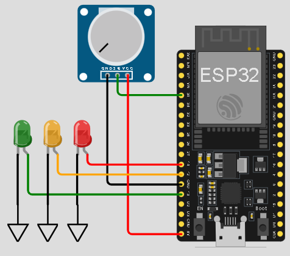
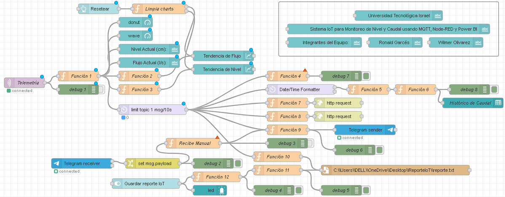
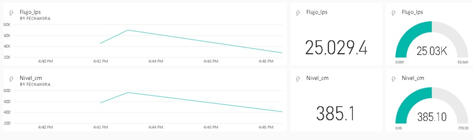

# IoT-Monitoreo-Nivel-Caudal
**Prueba de Concepto: Sistema IoT para Monitoreo de Nivel y Caudal usando MQTT, Node-RED y Power BI**

Este proyecto implementa un sistema IoT completamente simulado para monitorear el nivel de agua y estimar el caudal mediante una ESP32 en Wokwi, un flujo complejo en Node-RED, transporte MQTT y visualización en Power BI. La solución además registra datos en Google Sheets, genera un archivo TXT local y envía alertas automáticas a Telegram.

---

# Funcionamiento General

1. La ESP32 lee el valor del potenciómetro (sensor virtual de nivel).  
2. Publica el nivel por MQTT usando HiveMQ.  
3. Node-RED:
   - Calcula el caudal usando curvas de calibración.
   - Redondea y formatea las variables.
   - Envía los datos hacia:
     - Dashboard Node-RED
     - Google Sheets 
     - Power BI Streaming Dataset
     - Archivo `.txt`
     - Bot de Telegram
4. Power BI grafica los datos en tiempo real.
5. Google Sheets almacena históricamente cada registro.
6. El bot de Telegram envía actualizaciones cada 10 segundos.

---

## Cómo Ejecutar el Proyecto

### 1. Ejecutar la ESP32 en Wokwi
- Abrir https://wokwi.com  
- Crear un proyecto ESP32
- Armar el siguiente circuito

- Copiar el contenido de `sketch.ino`
- Dar clic en **Start the simulation**
- Esto enviará el valor del sensor al flujo principal.
- Puede abrir directamente el proyecto https://wokwi.com/projects/448838309663023105

---

### 2. Importar el flujo en Node-RED
- Abrir Node-RED  
- Menú superior, clic en **Import**  
- Seleccionar `Industria 4.json`
- Se observará el diagrama del Flujo en Node-RED:

 

- Hacer clic en **Deploy**  
- Acceder al dashboard:  
  👉 http://localhost:1880/ui

---

### 3. Configuración de Google Sheets
- El envío se realiza a través de Google Forms, que genera una hoja de cálculo automáticamente.
- Crear un formulario Google Forms con campos para:
   - Valor
   - Fecha
   - Nivel
   - Flujo
   - Hora
- Obtener la URL de envío
- En Node-RED, reemplazar en el nodo HTTP (luego de la función 8)
- **Importante:** El flujo utiliza las variables:
   - msg.payload1  
   - msg.payload2  
   - msg.payload3  
   - msg.payload4  
   - msg.payload5
- Cada una corresponde a un **entry** del formulario, y deben configurarse según sus IDs.

---

### 4. Power BI
- En Power BI ir a **My workspace**, **New item**
- Crear un **streaming dataset**
- Campos necesarios:
   - Valor (Number)
   - FechaHora (DateTime)
   - Nivel_cm (Number)
   - Flujo_lps (Number)
   - Hora (Text)  
- Copiar la URL del endpoint  
- Colocarla en el nodo HTTP de Node-RED (luego de la función 8) 
- Visualización en Power BI:
  

---

### 5. Registro Local en Archivo TXT
- Elegir una ruta donde se desea guardar el archivo .txt
- Copiarla en el nodo **write file** de Node-RED (luego de las funciones 10 y 11)
- El archivo puede replicarse como el `ejemplo-log.txt`

---

### 6. Telegram Bot
- Abrir Telegram
- Crear un bot con **@BotFather**.
- Guardar token
- Insertar token en el nodo **Telegram receiver**
- Buscar su chat ID usando:
  
   👉 https://api.telegram.org/bot<SU_TOKEN>/getUpdates

- Insertar el chatId en la función 9  

---

## Autor(es)
- Ronald Garcés
- Wilmer Olivarez

---

